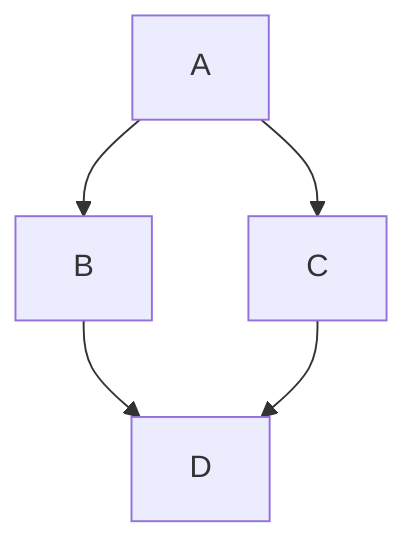

# Documentation

This documentation is built with [Docusaurus](https://docusaurus.io/) and hosted on [GitHub Pages](https://pages.github.com/).

[//]: # (#;< META)

You may re-use the configuration and structure of this documentation for your
own project.

[//]: # (#;> META)

The [configuration file](https://github.com/AlexSkrypnyk/scaffold/blob/main/docs/docusaurus.config.js)
allows to adjust the documentation to your needs.

## Diagrams

The configuration file includes [Mermaid](https://mermaid.js.org/) support for
diagrams.

See the [Mermaid syntax documentation](https://mermaid.js.org/intro/syntax-reference.html)
for more information on the Mermaid syntax.



## Spell checking

Spell checking uses [CSpell](https://cspell.org/) and a [custom configuration
file](https://github.com/AlexSkrypnyk/scaffold/blob/main/docs/cspell.json).

To check the spelling of the documentation, run the following command:

```bash
npm run spellcheck
```

## Publishing to Netlify on pull requests

Documentation is published to Netlify on every pull request and merge to `main`
using the [Deploy Docs to GitHub Pages](https://github.com/AlexSkrypnyk/scaffold/blob/main/.github/workflows/docs.yml)
GitHub Action.

Deployed documentation link will be added to the pull request as a comment.

### Netlify configuration

Set up a new site on Netlify and add the following environment variables
to the `Secrets and variables > Actions > Repository secrets` in GitHub settings:

- `NETLIFY_SITE_ID` - `Site > Site configuration > General > Site details > Site information > Site ID`
- `NETLIFY_AUTH_TOKEN` - `User settings > Applications > Personal access tokens > New access token`

## Publishing to GitHub pages on release

Documentation is published to GitHub Pages on release (tag) using
the [Deploy Docs to GitHub Pages](https://github.com/AlexSkrypnyk/scaffold/blob/main/.github/workflows/docs.yml)
GitHub Action.

This GitHub Action is designed to automatically build and publish documentation
to GitHub Pages.

The action uses concurrency controls to cancel any in-progress runs
if a new run is initiated, ensuring that only the latest changes are deployed.

The environment for this job is set to `github-pages`, and the URL for the
deployed page is dynamically generated.

## Terminal recordings

This template ships an [`AsciinemaPlayer`](https://github.com/AlexSkrypnyk/scaffold/blob/main/docs/src/components/AsciinemaPlayer/AsciinemaPlayer.js)
React component that embeds interactive [asciinema](https://asciinema.org/)
terminal recordings in your documentation.

Record a session to a cast file and place it under `static/img/`:

```bash
asciinema rec --output-format asciicast-v2 static/img/demo.cast
```

Then embed the player in any `.mdx` page:

```jsx
import AsciinemaPlayer from '@site/src/components/AsciinemaPlayer';

<AsciinemaPlayer src="/img/demo.cast" autoPlay loop controls />
```

The component lazy-loads the asciinema player assets in the browser, so it is
safe to render during a server-side build.
