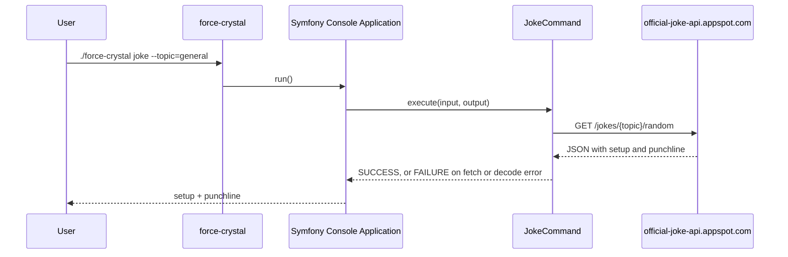
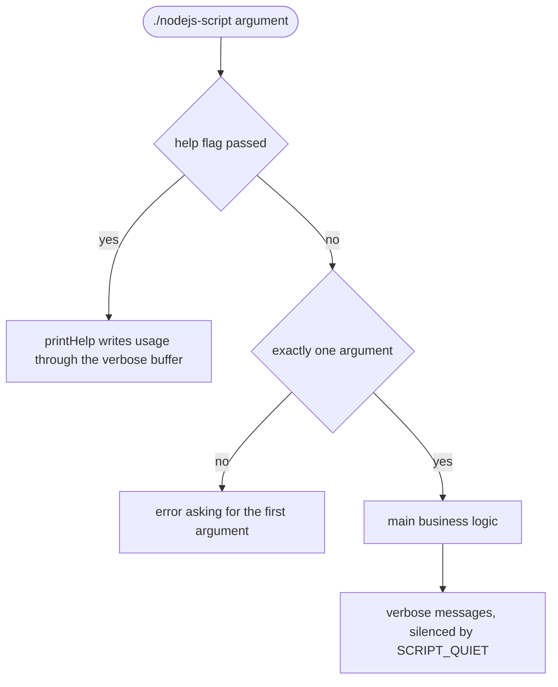
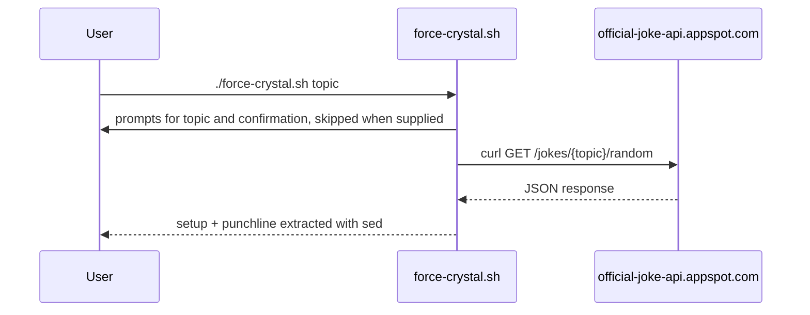

# Architecture

This is a walkthrough of how this project works: what ships in each selected stack, and how the primary flows run from the command line to the output. Each section is derived from the entry scripts and sources it names, and diagrams are embedded where the prose discusses them.

This document is generated and maintained by an AI agent via the `update-architecture-docs` skill in `.claude/skills/update-architecture-docs/SKILL.md`. The content is derived from the source code. If this documentation and the code disagree, the code wins.

## PHP application

### Console application

The PHP stack is a Symfony Console application. The `force-crystal` entry script resolves the Composer autoloader, registers the commands from `src/Command/`, and hands control to the Symfony `Application`, with `joke` set as the default command.

Commands live in the `YodasHut\App\Command` namespace, autoloaded PSR-4 from `src/`. `JokeCommand` accepts a `--topic` option, fetches a random joke from a public API, and prints the setup and punchline; any fetch or decode error is reported and returned as a command failure. `SayHelloCommand` is a minimal second command showing the multi-command structure.

PHP code is verified by PHPUnit tests in `tests/phpunit/` (unit tests with mocks in `Unit/`, integration tests against the real file system in `Functional/`) and by a three-layer quality stack: PHP_CodeSniffer, PHPStan, and Rector, wired as `composer lint` and `composer test`.

## NodeJS script

The NodeJS stack is a self-contained single-file CLI script, `nodejs-script`, with no runtime dependencies. It mirrors the testable-script pattern: business logic in `main()`, help in `printHelp()`, and output through a `verbose()` function that records messages into an internal buffer, with `SCRIPT_QUIET=1` suppressing output and `SCRIPT_RUN_SKIP=1` skipping execution for tests.

The script is verified by the built-in Node test runner (`npm run test` over `tests/nodejs/`, with c8 coverage) and linted by ESLint and Prettier via `npm run lint`.

## Shell script

The shell stack is an interactive Bash script, `force-crystal.sh`. It collects a topic and a confirmation through `ask` and `ask_yesno` prompt helpers (each skipped when the value is already supplied as an argument or environment variable), fetches a random joke from a public API with `curl`, extracts the setup and punchline with `sed`, and prints them.

`JOKE_URL_ENDPOINT` overrides the API endpoint, `SHOULD_PROCEED=y` bypasses the confirmation prompt, and `SCRIPT_DEBUG=1` enables trace output. The `main` invocation is guarded by a `BASH_SOURCE` check so BATS tests in `tests/bats/` can source the script and call its functions directly.

## Regenerating this document

To update this documentation after a structural change, ask the AI agent to "update architecture docs". The agent re-traces the affected diagrams and prose from the current code via the `update-architecture-docs` skill.
