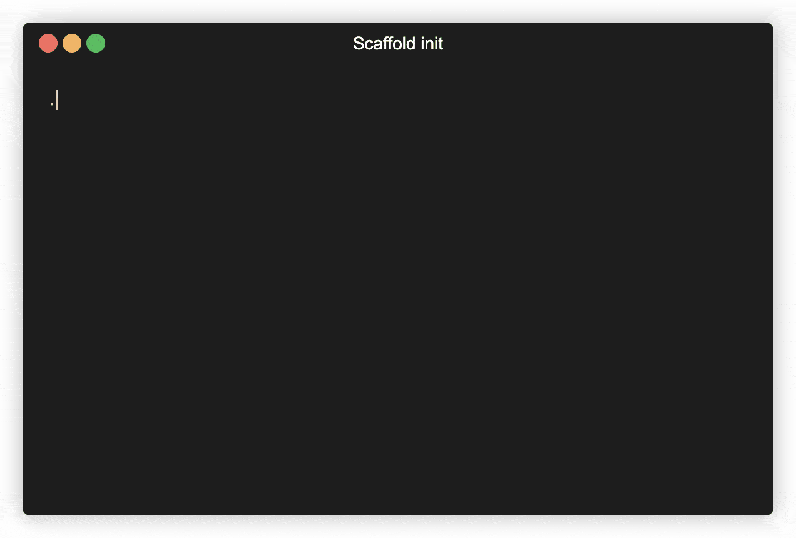

  

<h1 align="center">Generic project scaffold template</h1>

📘 [Scaffold documentation](https://getscaffold.dev)

## Features

- **Shell**
  - [Simple single-file script scaffold](shell-command.sh)
    with [BATS tests](tests/bats) (with coverage)
  - CI config to [Lint and test](.github/workflows/test-shell.yml) (with
    coverage)
- **PHP**
  - [`composer.json`](composer.json)
  - [Symfony CLI command app scaffold](src/app.php)
    with [unit tests](tests/phpunit/Unit/Command) (with coverage)
    and [traits](tests/phpunit/Traits)
  - [Simple single-file script scaffold](php-script)
    with [unit tests](tests/phpunit/Functional) (with coverage)
  - Code quality tools with
    configurations: [PHP Code Sniffer](phpcs.xml),
    [PHPStan](phpstan.neon), [Rector](rector.php)
  - CI config to [Lint, test](.github/workflows/test-php.yml)
    and [publish](.github/workflows/release-php.yml) PHP as [PHAR](box.json)
- **NodeJS**
  - [`package.json`](package.json)
  - CI config to [build and test](.github/workflows/test-nodehs.yml) and test
    for NodeJS
- **CI**
  - [Release drafter](.github/workflows/release-drafter.yml)
  - Release asset packaging and upload
  - [PR auto-assign](.github/workflows/assign-author.yml)
- **Documentation**
  - [Readme with badges](README.dist.md) and [generated logo](logo.png)
  - [Scaffold](docs) for the documentation site using [Docusaurus](https://docusaurus.io/)
  - Spell check with [CSpell](https://cspell.org/)
  - [Terminalizer](assets/terminalizer.yml) configuration file
- **Utility files**
  - [`.editorconfig`](.editorconfig), [`.gitignore`](.gitignore), [`.gitattributes`](.gitattributes)
  - [Renovate bot configuration](renovate.json)
  - [Pull request template](.github/PULL_REQUEST_TEMPLATE.md)
  - [Funding](.github/FUNDING.yml)
  - Init shell script to chose features

## How to use this scaffold repository

1. Click on **Use this template** > **Create a new repository**
2. Checkout locally
3. Run [`./init.sh`](init.sh) to replace `yournamespace`, `yourproject`,
   `Your Name` strings with your own and choose the features. 
   
